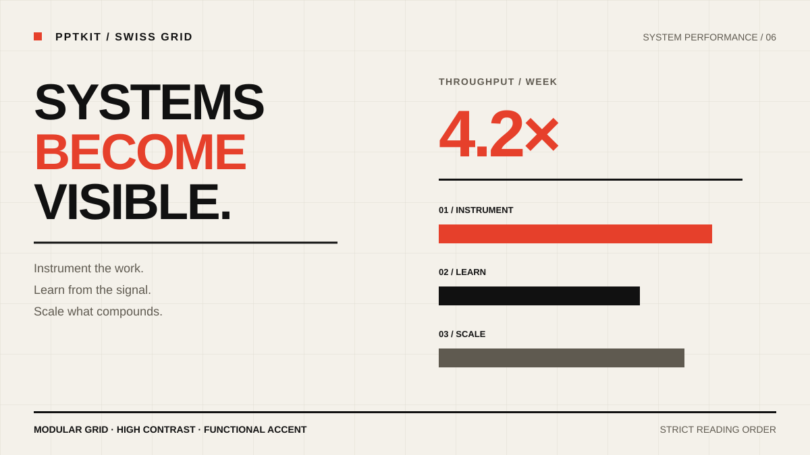

# PPTKit Presentation

Turn topics, documents, spreadsheets, images, and existing presentations into polished, editable PowerPoint decks. PPTKit Presentation combines structured deck authoring, a local-first browser review workflow, and explicit PPTX export in the `pptkit-presentation` Agent Skill.

Your source material, deck data, and assets stay local. Review the generated slides in the browser, then export an editable `.pptx` only when you choose to.

## Themes

The skill presents three visual languages before authoring. Each preview is a design direction—not a fixed slide template.

| Clean Business | Swiss Grid | Editorial Story |
| --- | --- | --- |
| [](skills/pptkit-presentation/assets/previews/clean-business.svg) | [](skills/pptkit-presentation/assets/previews/swiss-grid.svg) | [](skills/pptkit-presentation/assets/previews/editorial-story.svg) |
| Executive reviews, strategy, and business performance | Technical narratives, data analysis, and product launches | Research, thought leadership, and story-led presentations |

## Quick start

### Install

In a skill-enabled agent such as Codex, send:

```text
Install the `pptkit-presentation` skill from the GitHub repository `openHacking/pptkit-presentation`.
```

Or install it from the command line:

```bash
npx skills add openHacking/pptkit-presentation --skill pptkit-presentation -g
```

### Update

Ask your agent to update the installed skill:

```text
Update the `pptkit-presentation` skill from the GitHub repository `openHacking/pptkit-presentation`.
```

Or update installed skills from the command line:

```bash
npx skills update
```

## Usage examples

Create a deck from a topic:

```text
Use PPTKit to create an 8-slide presentation explaining our AI product strategy to company leadership. Recommend a theme and show me the outline before generating it.
```

Turn source material into an audience-specific presentation:

```text
Use PPTKit to turn the attached quarterly-report.pdf and metrics.xlsx into an editable 10-slide presentation for our executive review. Focus on performance drivers, risks, and next-quarter priorities.
```

Restyle an existing presentation:

```text
Use PPTKit to restyle the attached sales-kickoff.pptx in the Swiss Grid theme. Preserve the content structure, map each output slide to its source slide, and show me the proposed outline before generating it.
```

Export only after reviewing the browser preview:

```text
The preview looks good. Generate and download the editable PPTX.
```

## How it works

1. Provide a topic or attach source files, then describe the audience and desired outcome.
2. Choose a visual direction and confirm the proposed slide-by-slide outline.
3. Review the generated SVG slides in the local-first browser application and request revisions in chat.
4. Explicitly request **Generate & download PPTX** when the presentation is ready.

The browser application is a review and quality-assurance surface, not a pixel-identical PowerPoint renderer. Deck data and assets remain in your browser and are not uploaded by the preview application.

## Packages and applications

| Path | Responsibility |
| --- | --- |
| `packages/presentation-workflow` | Portable deck sessions, deterministic authoring recipes, source extraction, and quality checks. |
| `apps/preview` | Local-first browser review and explicit PPTX export application. |
| `skills/pptkit-presentation` | Cross-agent workflow, references, theme previews, and isolated Node fallback starter. |

The underlying presentation engine lives in [openHacking/pptkit](https://github.com/openHacking/pptkit). This repository consumes only its published public APIs.

## Development

PPTKit Presentation requires Node.js 20 or newer and pnpm 10.13.1.

```bash
pnpm install
pnpm --filter presentation-preview dev
pnpm build
pnpm typecheck
pnpm lint
pnpm test
pnpm run pack:check
```

The preview dev command writes the repository skill path and active preview URL to `.pptkit-local-preview.json`. The root `AGENTS.md` makes new Codex tasks use those local development inputs instead of globally installed or published copies. Start the command, then open a new task in this repository to exercise the uncommitted skill against `http://127.0.0.1:5173/`. Already-open tasks do not reload repository instructions or skill definitions.

## Documentation

- [Presentation skill guide](docs/guides/presentation-skill.md)
- [`presentation-workflow` API](docs/api/presentation-workflow.md)
- [Repository architecture](docs/architecture/README.md)

## License

MIT
